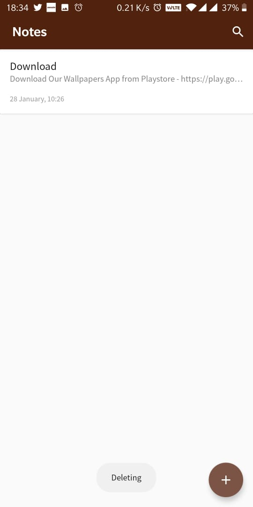
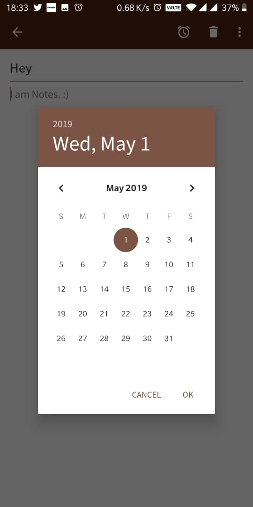

# Notes
Simple Notes Application That Uses Android Architecture Components - ViewModel, Room and LiveData. This is just for my practice but if you wish to contribute I will be glad.

## Components

Room, LiveData and ViewModel

## Screenshots

</img>
</img>
</img>
</img>
</img>
</img>
</img>

          
